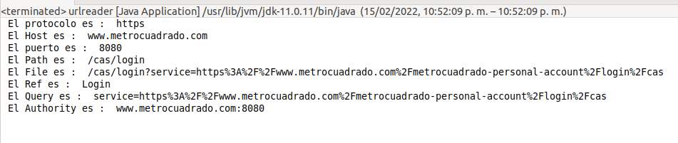
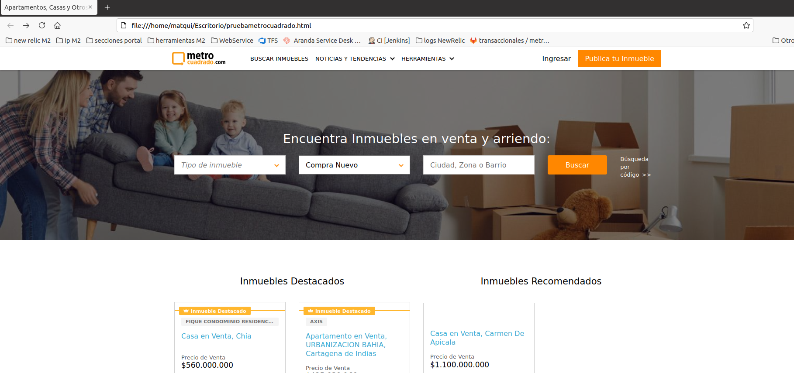
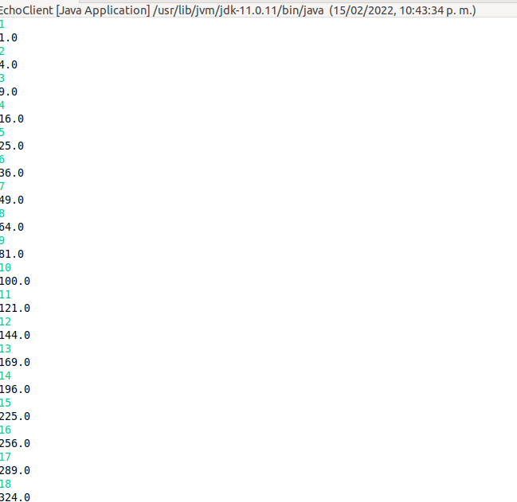
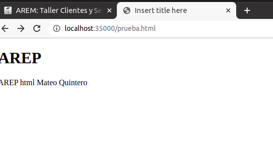

# Clientes Y Servicios AREP

Este programa cuenta con 4 paquetes diferentes, los 3 primeros hacen referencia a los ejercicios propuestos en el TALLER CLIENTES Y SERVICIOS y el otro paquete hace referencia a los Retos 1 y 2

### Despliegue Heroku
[](https://clienteyservidor.herokuapp.com/)

### Aplicativo:

* Ejercicio 1 URLreader indica los 8 metodos para conocer de que manera esta formada una URL

 

* Ejercicio 2 paquete URLreadinfo clase para leer el contenido de una URL. Se realizo la prueba copiando el html resultado luego de leer el contenido y observandolo en local EJEMPLO con portal metrocuadrado:


 

* Ejercicio 3 paquete square number, estan implementados la clase servidor y cliente donde el cliente indica un numero y el servidor le devuelve el cuadrado del numero

 

* Ejercicio 4  paquete Server Representa el servidor web que retorna los archivos que se soliciten dado su path http://localhost:35000/ARCHIVOABUSCAR ejemplo:  http://localhost:35000/prueba.html

 

### Como Ejecutarlo?

Se debe lanzar para ejercicio 3 el cliente y servidor para que se conecten, una vez conectados se pueden enviar los mensajes desde cliente y que servidor indique respuesta

### Prerrequisitos

Los pasos a continuación permiten clonar el programa en su computador.


Eston son los requisitos que software que tienen que estar instalados previamente:

```
Maven
```
```
Git
```
```
Fue ejecutado con version java 11
```


## Construcción 
* [Maven](https://maven.apache.org/) - Dependencias de maven

## Fecha
* 15 Febrero 2022

## Autores

* **Mateo Quintero Acevedo** 

## Javadoc

* El javadoc fue obtenido mediante la herramienta eclipse quien cuenta con la opcion de autogenerado
	
## Licencia

En este proyecto se usó la licencia GNU - se puede ver [LICENSE](LICENSE) para más detalles.


